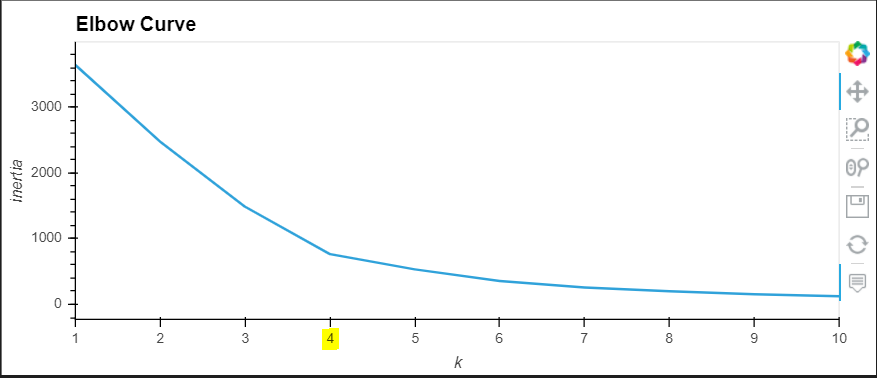
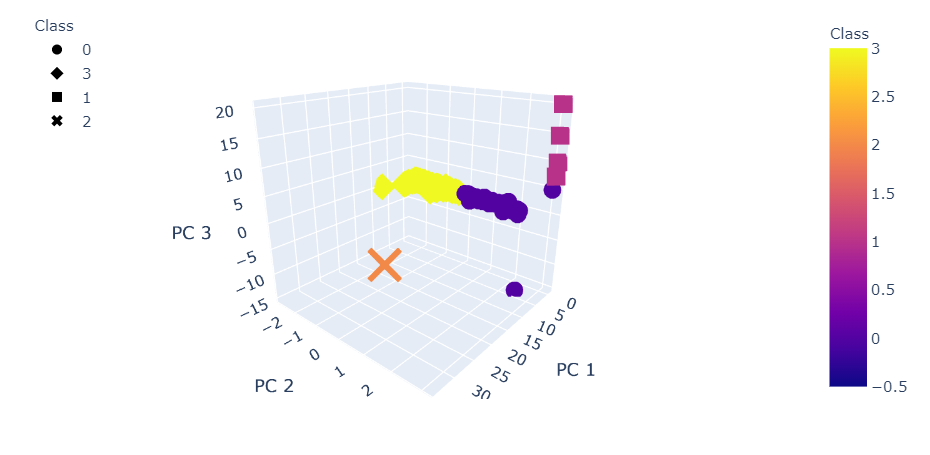
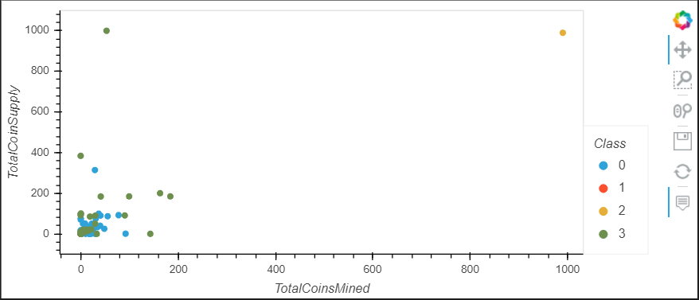

# Cryptocurrencies

## Overview
Showcase new crypto currency options to be included customer investment portfolio. Using data extracted from the trading market, we will need to group the crypto currencies into classifications to determine which will be most suited for investment needs. Clustering the data will be done using the PCA and KMeans algorithms.

## Results
Utilizing inertia and k means, an elbow curve was created to visualize the appropriate number of clusters. In this graph, 4 was the right number of clusters to use for the KMeans model.  
  
  
Plotting out the crypto currencies on a 3D scatter plot can visualize the relationship amongst the four different classes.
  
  
The 2D scatter plot takes a look of each crypto currencies with comparison to total coin supply and total coins mined.
  

## Summary
The visuals would help investor determine if certain currencies will be a good fit for their portfolio. Currencies with too much supply might not perform as well when looking at value increases and currencies with low mining might not be as popular to obtain which leads to low investment returns as well.  
